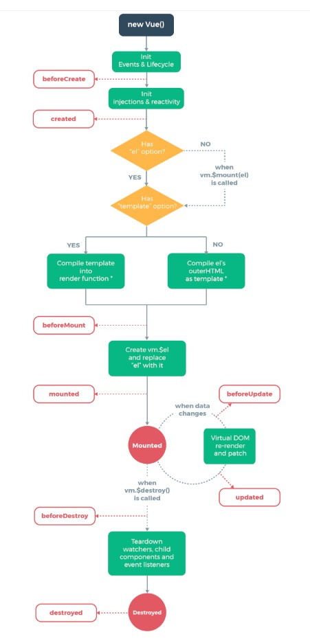

Vue
===

Vue (读音 /vjuː/，类似于 view) 是一套用于构建用户界面的[渐进式框架]。与其它大型框架不同的是，Vue 被设计为可以自底向上逐层应用。Vue 的核心库只关注[视图层]，不仅易于上手，还便于与第三方库或既有项目整合。另一方面，当与现代化的工具链以及各种支持类库结合使用时，Vue 也完全能够为复杂的单页应用提供驱动。

---

# 基于 Vue 创建一个简单的项目

```
 npm  install --global vue-cli // 安装vue
 vue init webpack vue-demo // vue基于webpack的模块项目
 cd vue-demo // 进入vue-demo文件夹
 npm intall or yarn  // 安装packjson.json中依赖的node_modules
 npm run dev
```

---
# Vue 生命周期



---
# Vue执行顺序
- beforeCreate
  在实例初始化之后，数据观测(data observer) 和 event/watcher 事件配置之前被调用。
- created
  实例已经创建完成之后被调用。在这一步，实例已完成以下的配置：数据观测(data observer)，属性和方法的运算， watch/event 事件回调。然而，挂	  载阶段还没开始，$el 属性目前不可见。
- beforeMount
  在挂载开始之前被调用：相关的 render 函数首次被调用。

---

- mounted
  el 被新创建的 vm.$el 替换，并挂载到实例上去之后调用该钩子。如果 root 实例挂载了一个文档内元素，当 mounted 被调用时 vm.$el 也在文档内。

- beforeUpdate
  数据更新时调用，发生在虚拟 DOM 重新渲染和打补丁之前。 你可以在这个钩子中进一步地更改状态，这不会触发附加的重渲染过程。
- updated
  由于数据更改导致的虚拟 DOM 重新渲染和打补丁，在这之后会调用该钩子。
	当这个钩子被调用时，组件 DOM 已经更新，所以你现在可以执行依赖于 DOM 的操作。然而在大多数情况下，你应该避免在此期间更改状态，因为这可能会导致更新无限循环。
该钩子在服务器端渲染期间不被调用

---

- beforeDestroy
实例销毁之前调用。在这一步，实例仍然完全可用。
- destroyed
   Vue 实例销毁后调用。调用后，Vue 实例指示的所有东西都会解绑定，所有的事件监听器会被移除，所有的子实例也会被销毁。 该钩子在服务器端渲染期间不被调用。

---

# Vue 结构简单介绍

```
  export default {
    props: { // 单项数据绑定， 当父组件的数据发生变化, 将传递给子组件
    },
    data () {
      return { // 声明变量
        msg: 'hello'
      }
    },
    components: { // 引入子组件
    },
    computed: { // 引入store里的一些数据: session ...
      ...mapGetters({
      })
    },
    methods: { // 方法
      init () {
      }
    },
    created () { // 钩子函数： Vue实例生成后调用
    },
    mounted () { // 当页面加载完成之后执行，一般用作初始化数据
    }
  }
  ```
---

# 模板语法

Vue.js 使用了基于 HTML 的模板语法，允许开发者声明式地将 DOM 绑定至底层 Vue 实例的数据。所有 Vue.js 的模板都是合法的 HTML ，所以能被遵循规范的浏览器和 HTML 解析器解析。

在底层的实现上，Vue 将模板编译成虚拟 DOM 渲染函数。结合响应系统，Vue 能够智能地计算出最少需要重新渲染多少组件，并把 DOM 操作次数减到最少。

---
# 案例

```
<span>Message: {{ msg }}</span>
```
```
<p>Using v-html directive: <span v-html="rawHtml"></span></p>
```
```
<div v-bind:id="dynamicId"></div>
```
```
<p v-if="seen">现在你看到我了</p>
```
---

# 缩写

```
<!-- 完整语法 -->
<a v-bind:href="url">...</a>

<!-- 缩写 -->
<a :href="url">...</a>
```
```
<!-- 完整语法 -->
<a v-on:click="doSomething">...</a>

<!-- 缩写 -->
<a @click="doSomething">...</a>
```
---

# 传值

### a. 父传子 子组件通过props接受父组件的参数
- 子组件在props中创建一个属性，用以接收父组件传过来的值
- 父组件中注册子组件
- 在子组件标签中添加子组件props中创建的属性
- 把需要传给子组件的值赋给该属性
### b. 子传父 子组件通过emit触发父组件的方法
- 子组件中需要以某种方式例如点击事件的方法来触发一个自定义事件
- 将需要传的值作为$emit的第二个参数，该值将作为实参传给响应自定义事件的方法
- 在父组件中注册子组件并在子组件标签上绑定对自定义事件的监听
### c. 非父子组件

---
# 父传子
#### 静态props: 组件实例的作用域是孤立的。这意味着不能 (也不应该) 在子组件的模板内直接引用父组件的数据。要让子组件使用父组件的数据，需要通过子组件的 props 选项
#### 动态props: 在模板中，要动态地绑定父组件的数据到子模板的 props，与绑定到任何普通的HTML特性相类似，就是用 v-bind。每当父组件的数据变化时，该变化也会传导给子组件
#### prop 是单向绑定的：当父组件的属性变化时，将传导给子组件，但是不会反过来。这是为了防止子组件无意修改了父组件的状态——这会让应用的数据流难以理解。另外，每次父组件更新时，子组件的所有 prop 都会更新为最新值。这意味着不应该在子组件内部改变 prop。如果这么做了，Vue 会在控制台给出警告

---
# 案例
## a-1. 静态props
- parent

```
<template>
  <div class="parent">
    <Child msg="111"/>
    <Child msg="222"/>
  </div>
</template>
```
- child
```
<template>
  <div class="child">
    Child: {{msg}}
  </div>
</template>
```
---
### Child中js写法
```
<script>
export default {
  props: {
    msg: {
      type: String
    }
  }
}
</script>
```
---
## a-2. 动态props
- parent

```
<template>
  <div class="parent">
    Parent: <input v-model="msg" />
    <br />
    <Child :msg="msg"/>
  </div>
</template>
```
- child
```
<template>
  <div class="child">
    Child: {{msg}}
  </div>
</template>
```
---

# 子传父: 子组件通过emit触发父组件的方法

### child
```
<template>
  <div class="child">
    Child: {{msg}}
    <button @click="childClick">Change Msg</button>
  </div>
</template>
<script>
export default {
  props: {
    msg: {
      type: String
    }
  },
  methods: {
    childClick () {
      this.$emit('changeMsg', 'child')
    }
  }
}
</script>

```
---
### Parent
```
<template>
  <div class="parent">
    Parent: <input v-model="msg" />
    <br />
    <Child :msg="msg" @changeMsg="changeMsg"/>
  </div>
</template>
<script>
import Child from './Child.vue'
export default {
  components: { Child },
  data () {
    return {
      msg: 'Welcome to Your Vue.js App'
    }
  },
  methods: {
    changeMsg (v) {
      this.msg = v
    }
  }
}
</script>
```
---
# 非父子组件
### 非父子组件之间传值，需要定义个公共的公共实例文件bus.js，作为中间仓库来传值

```
//bus.js
import Vue from 'vue'
export default new Vue()
```

---
组件A
```
<template>
  <div class="hello">
    同级元素: {{isShow}}
  </div>
</template>
<script>
import Vue from 'vue'
import bus from '../bus.js'
 export default {
   name: 'HelloWorld',
   data () {
     return {
       isShow: false
     }
   },
```
----
```
   created () {
     bus.$on('setIsShow', () => {
       this.setIsShow()
     })
   },
   methods: {
     setIsShow () {
       this.isShow = !this.isShow
     }
   }
 }
</script>
```

---

组件B

```
<template>
  <div class="child">
    <button @click="changeShow">change show</button>
  </div>
</template>

<script>
import bus from '../bus.js'
export default {
  methods: {
    changeShow () {
      bus.$emit('setIsShow')
    }
  }
}
</script>
```
---
# js 改写成 ts
- 环境配置
- 实例应用
---

```
<template>
  <div class="hello">
    同级元素: {{isShow}}
  </div>
</template>
<script lang="ts">
import Vue from 'vue'
import bus from '../bus'
import Component from 'vue-class-component'
@Component({
})
export default class HelloWorld extends Vue {
  isShow:any = false
  created () {
    bus.$on('setIsShow', () => {
      this.setIsShow()
    })
  }
  setIsShow () {
    this.isShow = !this.isShow
  }
}
</script>
```
---
```
export default {
  name: 'HelloWorld',
  data () {
    return {
      isShow: false
    }
  },
  created () {
    bus.$on('setIsShow', () => {
      this.setIsShow()
    })
  },
  methods: {
    setIsShow () {
      this.isShow = !this.isShow
    }
  }
}
```
---
# ------------------ END ------------------
